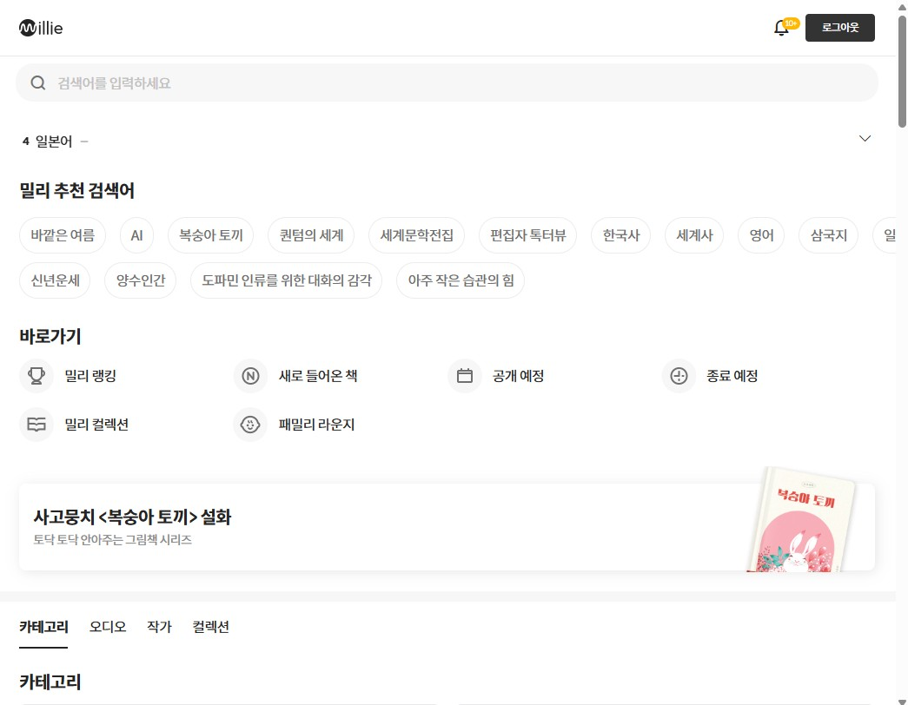

# 6주차 과제 : 카드 검색 리스트

---

## 과제 내용

- 구현하고자 하는 UI
  
  

---

## 회고

- 깃 Action으로 배포시 계속 MIME TYPE ERROR가 떠서 Vercel로 배포했더니 잘 로드된다.
  

- vercel 배포 주소 새로고침 시 404에러 해결
  : https://velog.io/@hying/Vercel-Vite-Build-Error-Vercel-Vite-%EB%B0%B0%ED%8F%AC%EC%8B%9C-%EB%9D%BC%EC%9A%B0%ED%84%B0-%EC%83%88%EB%A1%9C%EA%B3%A0%EC%B9%A8-404-%EC%97%90%EB%9F%AC

- 리액트 라우터 돔을 이용한 라우팅 -> 인덱스 페이지에 사용
  : https://woongtech.tistory.com/entry/%EB%A6%AC%EC%95%A1%ED%8A%B8-%EB%9D%BC%EC%9A%B0%ED%84%B0-%EC%8D%A8%EB%B3%B4%EA%B8%B0-reactroutertypescript
